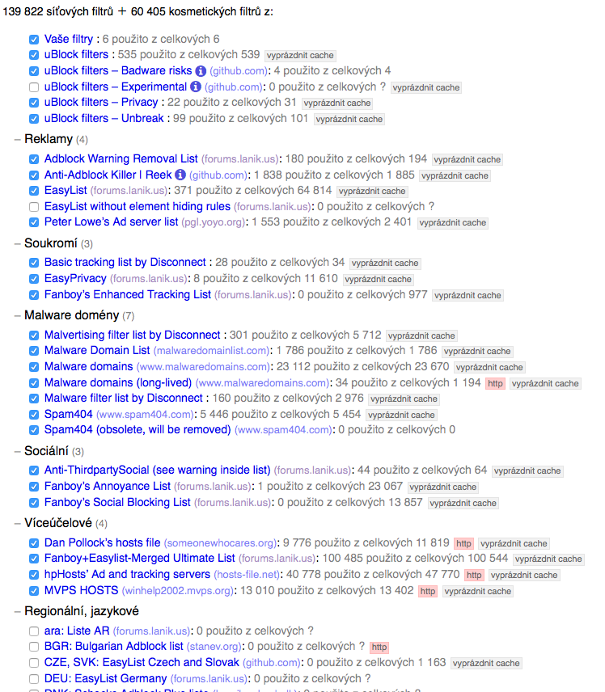

# Kisuke's Czech supplementary blocklist

## About

Czech filter created for [uBlock Origin](https://github.com/gorhill/uBlock).

Just supplementary to other filters - I am blocking only content that pisses me (very annoying ads, some bad javascript, ...) off and are not blocked by some other filter I am using.

### Contact
Feel free to send me suggestions how to improve this filter to my mailbox kisuke[zavi_nac]kisuke.cz. I will consider to add some filter for desired webpage.

## Usage
Just add this filter URL to your adblocking software:
> https://raw.githubusercontent.com/Kisuke-CZE/blocklist/master/blocklist

## Firefox 57+ users
If you upgraded to Firefox 57 or newer version, you must use uBlock Origin 1.14.23b11 or newer. Previous versions of uBlock Origin are not fully compatible with new Firefox versions (for example inline filtering is broken...).

If there is no stable build of uBlock on Mozilla's extensions website, lease use version from [beta channel](https://addons.mozilla.org/en-US/firefox/addon/ublock-origin/versions/beta).

## Recommended browsers
Since I was recieving questions about filter functionality, I explain my browser setup a little.

My filter is using [Inline script filtering](https://github.com/gorhill/uBlock/wiki/Inline-script-tag-filtering). Since Chromium-based browsers do not support this feature (because Google does not want to users be able to filter all bad scripts), some rules in my filter will not work in Chromium, Chrome, Vivaldi, or any Chromium-based browser.

This is one of reasons I can't recommend any Chromium-based browser for daily use. But there are some great browsers on the market. Here is list of recommended browsers which I think is very good for daily use and the also supports Inline script filtering:

### [IceCat](https://www.gnu.org/software/gnuzilla/)

### [IceWeasel](https://wiki.debian.org/Iceweasel)

### [Firefox](https://www.mozilla.com/firefox/)

### [Waterfox](https://www.waterfoxproject.org)

### [Pale Moon](https://www.palemoon.org/)

I don't recommend to use EasyList Czech and Slovak, because they are whitelisting (adding rules to whitelist something which overwrites other filters) some bad javascripts.

But I can recommend [Prebake filter](http://prebake.eu/), which removes anoying cookies warnings.

There is also screenshot from my uBlock Origin settings to see what filters I am using:

